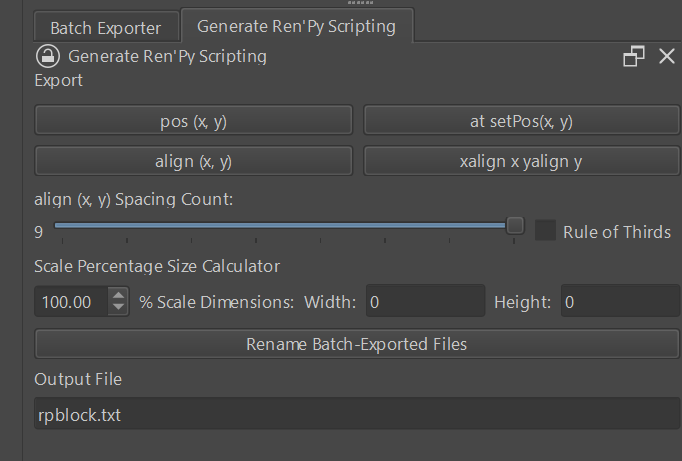

# Generate Ren'Py Scripting

Generate Ren'Py Scripting is a Python plugin for Krita. GRS outputs a block of Ren'Py scripting to display the images of the active Krita document as they appear on the canvas, working in tandem with the [krita-batch-exporter](https://github.com/GDQuest/krita-batch-exporter). The output file is automatically opened so that you may immediately copy and paste the text into your Ren'Py project. The idea is to make working between Ren'Py and Krita as efficient as possible!

# How to Use

 1. Determine the image export scale you are going to use. The included Scale Percentage Size Calculator will tell you the dimensions of the image at the given scale; for Ren'Py, you'll likely want to get it close to 1920x1080 pixels.
 2. Batch export the image's elements using KBE (krita-batch-exporter). This means that the layers you wish to export must follow the syntax defined in the [KBE manual](https://github.com/GDquest/krita-batch-exporter/blob/master/batch_exporter/Manual.md); this program's features will not work with incorrectly formatted layer names! The layer name (the actual name substring) will be used as the image name in the Ren'Py script.
 3. (Optional) Customize the name of the output file (rpblock.txt by default). Do so if you wish to make and save multiple output files, though the practical use is to have rpblock.txt as a temporary file akin to scratch paper.
 4. Choose your output type.
	1. If you need `pos (x, y)` scripting, press `pos (x, y)`.
    2. If you need `align (x, y)` or `xalign x yalign y` scripting:
       1. Choose the number of evenly-distributed spacings to use.  The Rule of Thirds toggle has the same effect as choosing 4 spacings [0.0, 0.333, 0.666, 1.0].
       2. Press `align (x, y)` or `xalign x yalign y`.
 5. (Optional) Use the Additional ATL system to add an `at function()` statement.
	 1. ATL functions may be written with a layer with the name `ATL <name of layer to target>`.
	 2. The function must be given in the format `f=<function(parameter 1, parameter 2, etc.)>`. `func` and `function` also work as tags.
	 3. If `currX` and `currY` are used in the string, the output will use the bounding box top left corner coordinates of the layer's contents, scaled to the lowest given resolution. For example, if the target layer has the metadata `s=100,50`, `currX` and `currY` will be calculated for 50% the image's size, and then written into the exported text. Any other variable that you type in will simply be carried over as-is.
	 4. Property tags such as `alpha` and `subpixel` are supported; see the manual for details, including the full list.
 6. After you choose a save location, the exported file will be opened in the program default for its type automatically. Copy and paste its text where you need it in your Ren'Py script. I like to save to Desktop so that I could find and delete the file afterwards easily.
 7. Make changes to your Ren'Py script as necessary. GRS gets you started with the basic image display template and can be used to add an `at function()` statement, but any further ATL statements still need to be declared manually!

For more information with examples, see the [manual](https://github.com/SeanHRN/generate-renpy-scripting/blob/master/manual.md).

# Download and Installation
Quickest Way via Python Plugin Manager (from Web):
Open Krita and go to `Tools -> Scripts -> Import Python Plugin from Web`.
Enter as the download URL: https://github.com/SeanHRN/generate-renpy-scripting

Alternatively:
Download the [zip or tar.gz](https://github.com/SeanHRN/generate-renpy-scripting/releases).

Easy Install via Python Plugin Manager (from File):
Open Krita and go to `Tools -> Scripts -> Import Python Plugin from File`. Select `generateRenpyScripting_x.x.zip`.

Long Way:
Unzip `generate-renpy-scripting-x.x.x.zip`. Place `generateRenpyScripting` (the folder) and `generateRenpyScripting.desktop` in the pykrita directory.
You may find the location of the pykrita folder by opening Krita and clicking
 `Settings -> Manage Resources -> Open Resource Folder`.

Proceed to Enabling GRS in Krita.

# Enabling GRS in Krita
1. Open Krita.
2. Go to `Settings -> Configure Krita -> Python Plugin Manager`.
3. `Generate Ren'Py Scripting` will be in the list; check its box.
4.  Restart Krita.

# Features To Possibly Implement
  - Compatibility with the Batch Exporter's custom output path feature.
  - GUI text bar to notify the user of success/failure in export to match Krita Batch Exporter's design.  Currently, a separate window opens if the user tries to run the plugin when a Krita file hasn't been opened, and the only notification of success is the automatic file opening.

# Known Issues
 - The calculator's dimensions don't automatically update when the canvas's size changes,
 for example, upon cropping. I don't know of a signal to handle that.
 - The main example in the manual is outdated because it was made before the Batch Exporter allowed non-whole numbers \
for scale percentage. I will make a new example.

# Feedback
Do you have suggestions on how to make the plugin better? Are there any commonly-used templates that you want to see as export options? Let me know here.

# License
Generate Ren'Py Scripting is released under the GNU General Public License (version 3 or later).
