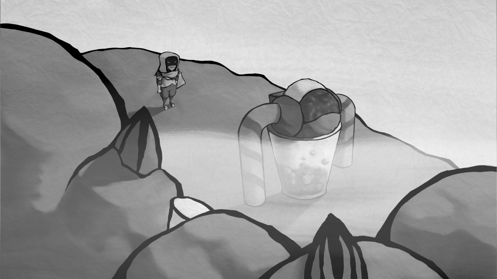
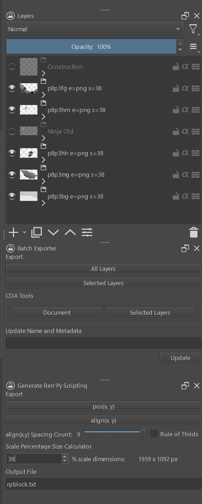
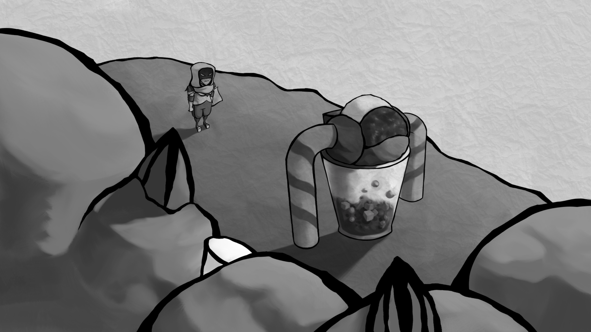
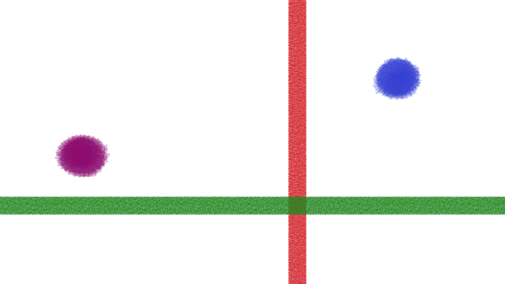
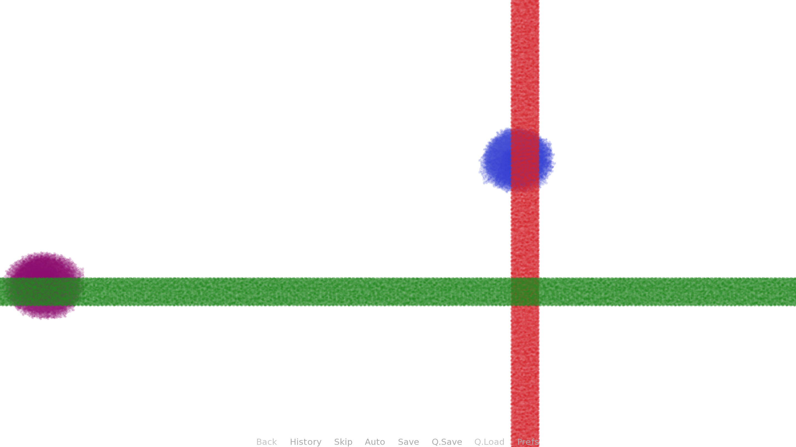

# Generate Ren'Py Scripting
by Sean Castillo
Version 1.3

This plugin uses the contents of a Krita document and the layer name syntax for the [Krita Batch Exporter](https://github.com/GDQuest/krita-batch-exporter) by GDQuest to generate a block of text for a Ren'Py script. The block is saved into a file and then automatically opened in the default program for that file extension (e.g. Notepad for .txt on Windows) so that the user may immediately copy and paste the text into a Ren'Py script file. The goal is to coordinate the composed images as they appear in Krita to display the same way in Ren'Py as efficiently as possible by calculating the coordinates and doing the bulk of the typing automatically. Be sure to use images exported by the Batch Exporter to maintain consistency with this plugin's coordinates output.

In order for a layer to be included, it must be toggled visible and follow the [krita-batch-exporter syntax](https://github.com/GDquest/krita-batch-exporter/blob/master/batch_exporter/Manual.md),
i.e. contain "e=png" or "e=jpg" directly following the actual name of the layer.

The user may choose between `pos (x, y)` statements and `align (x, y)` statements for output.
To change the output for your project's needs, edit the lines in `writeData()`.

## pos (x, y) Output
By default, the `pos (x, y)` coordinates in the block are how the content of each layer appears on Krita's canvas.
The coordinates refer to the top left corner of the bounding box for all non-transparent pixels in that layer.

## align (x, y) Output

The user may use the slider to choose the number of evenly-spaced spots at which to assign `align (x, y)`coordinates,
 from 2 to 9. Each image is assigned to the intersection between a vertical spacing and a horizontal spacing closest to its center point.

For example, if 5 is chosen, the set of available spots (per axis) would be [0.0, 0.25, 0.5, 0.75, 1.0].

The Rule of Thirds mode uses the set [0.0, 0.333, 0.666, 1.0]; it's the same as using 4 on the slider.
When the checkbox is toggled, the align(x, y) output always uses 4.

## Properties and Scale Percentage Size Calculator
 - s  - 'size' in scale percentage
 - m - 'margin' width in pixels

If more than one size is listed, the minimum size is used for the Ren'Py block.
This is because it's typically best to draw an image extra big and then scale it down for the project's target resolution.
For this, the Scale Percentage Size Calculator helps. Enter a percentage, and the text label will say the dimensions of the image at that scale.

Currently, the margin option nudges the `(x, y)` coordinates of the image up and left that many pixels.

## Rename Batch-Exported Files (Name Pending)
This feature is accessed with a checkbox. When it's active, pressing export will also copy over the batch-exported images of the smallest scale to a new folder in which they don't have the Batch Exporter's `_@[scale]x` suffix, so that those images are ready to cut and paste into the Ren'Py project; you wouldn't need to rename the files manually.

## Ren'Py Formats
```
# Empty Line
    show background:
        pos (0, 0)
    show character:
        pos (0, 0)
# Empty Line
    pause
```
```
# Empty Line
    show background:
        align (0.0, 0.0)
    show character:
        align (0.0, 0.0)
# Empty Line
    pause
```
The block starts one indent in because it would be pasted into a Ren'Py script under a label statement.

## pos (x, y) Example
Here's a screenshot of a panel from *Homeless Rice Ninja: The Rocky Road*, featuring [HRN](https://krita-artists.org/t/homeless-rice-ninja/36398) and [Halo-Halo](https://krita-artists.org/t/halo-halo/36741).


[Here's a recording of the panel in motion.](https://youtu.be/c4oeaK74Zl4)

To test this plugin, I remade the panel.
The full-sized Krita document for this image is 5103x2873 px.


I renamed the layers to match how I name the images in Ren'Py. For example, p8p3hrn means "Page 8 Panel 3 HRN". I chose 38% as the scale; as the calculator states, that would make the image size 1939x1092 px, which is just slightly bigger than my target size of 1920x1080 px.

Here's the resulting rpblock.txt:

        show p8p3bg:
            pos (0, 0)
        show p8p3mg:
            pos (304, 184)
        show p8p3hh:
            pos (834, 306)
        show p8p3hrn:
            pos (476, 202)
        show p8p3fg:
            pos (0, 87)

        pause


It doesn't have the fog because I handle scrolling graphics separately, but all the other components are properly displayed!

 - For the first version of the image, each component's PNG was manually cropped to reduce empty space and then<br> given approximated `pos (x, y)` locations. For the remade version, I first ran Krita Batch Exporter to get the PNGs<br> with automatic and precise trimming so that the PNGs would work with the coordinates printed by<br> Generate Ren'Py Scripting. That's why there may be slight differences.
 -  37.6249% would be significantly more accurate than 38%, but Krita Batch Exporter doesn't allow non-integer<br> values for percentage.
 - rpblock.txt does start with the empty line, but I don't know how to get that to work in Markdown yet.
 - This example was made using version 1.0 of the program, which is why the menu is different in the picture.

## align (x, y) Example
Here's a 1920x1080 px test document with stuff to align.


With `Rule of Thirds` toggled on, here is the `align (x, y)` output:

        show Background:
            align (0.333, 0.333)
        show Blue:
            align (0.666, 0.333)
        show Magenta:
            align (0.0, 0.666)
        show Red:
            align (0.666, 0.666)
        show Green:
            align (0.333, 0.666)

    pause
 Here's how the images appear in Ren'Py:
 

The magenta dot's center was closer to the left edge than the first horizontal third by just 14 pixels.

## Rename Batch-Exported Files Example


The images to the right of the folder are in the state that the Batch Exporter makes them; the size is 27%, so the suffix is `_@0.27x`. The folder has been made through GRS (upon pressing export) with the name `x0.27`.


In the `x0.27` folder, the images have been copied over with the suffix removed, so these files are ready to be cut and pasted into a Ren'Py folder. I could cut all the images directly, or, if I need the folder structure, I could cut the folder and rename it at the destination.
## Notes

 - The manual for Krita Batch Exporter is [here](https://github.com/GDQuest/krita-batch-exporter/blob/master/batch_exporter/Manual.md).
 - Tip: Group Generate Ren'Py Scripting and Krita Batch Exporter together as tabs to save space (unlike how I had them \
in the examples.)
 - This plugin allows non-integer values for size percentage via `round()`, but Krita Batch Exporter does not. The included Scale Percentage Size Calculator uses integer values only.
 - Metadata tags are case-insensitive in this plugin but case-sensitive in Krita Batch Exporter.
 - If a group layer and its contained layer both have metadata, the group properties have priority.
 - The line for the output file name is at the bottom because I think it's the widget that users\
 would need to touch the least often; that file is meant to be temporary.

## Features To Possibly Implement

 - GUI text bar to notify the user of success/failure in export to match Krita Batch Exporter's design.<br> Currently, a separate window opens if the user tries to run the plugin when a Krita file hasn't been opened,<br> and the only notification of success is the automatic file opening.
 - Provide more export templates.

## That's It!
Feedback would be greatly appreciated. Send a message to my [krita-artists.org page](https://krita-artists.org/u/HyDrone/summary).
See more of *Homeless Rice Ninja: The Rocky Road* [here](https://seanhrn.itch.io/homeless-rice-ninja-the-rocky-road). I post character art on my Krita-Artists [portfolio](https://krita-artists.org/u/hydrone/activity/portfolio).
